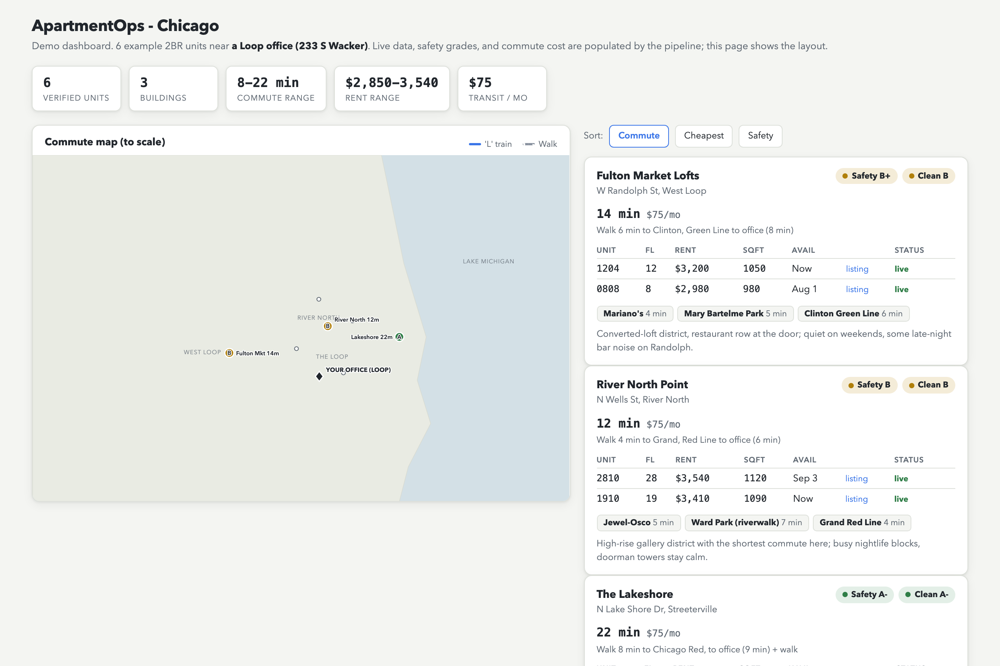
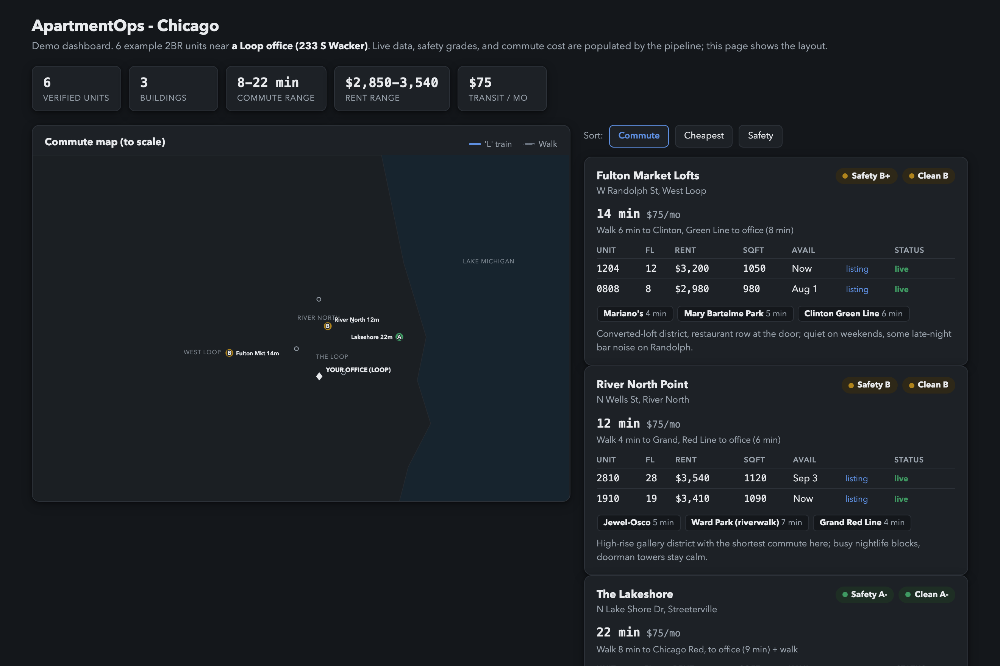
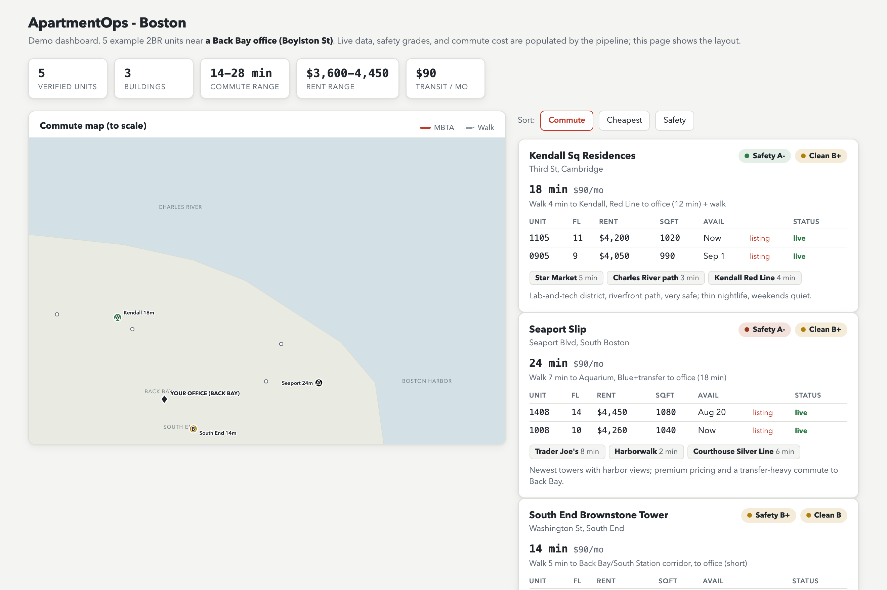
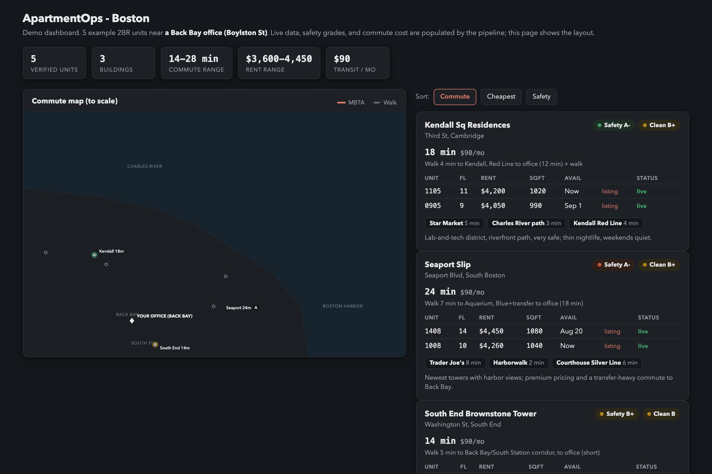

<!-- logo -->
<pre>
          _____________
         /            /|
        /____________/ |
        |  _   _   _ | |          A P A R T M E N T O P S
        | |_| |_| |_|| |          =========================
        |  _   _   _ | |          find it. verify it. map it.
        | |_| |_| |_|| |
        |  _   _   _ | |          a verified apartment-hunting
        | |_| |_| |_|| |          pipeline for Claude Code
        |  _   _   _ | |
        | |_| |_| |_|| |
        |  _   _   _ | |
        | |_| |_| |_|| /
        |  _   _   _ |/
     ___|_|_|_|_|_|_|___
    /__________________/|
    |__________________|/
</pre>

# ApartmentOps

A set of [Claude Code](https://claude.com/claude-code) skills that turn
"find me an apartment" into a verified, mapped, evidence-backed shortlist -
and let anyone set it up for their own city and commute from scratch.

Most apartment searches drown in stale listings, marketing walk-times, and
"net effective" prices that quietly revert at renewal. ApartmentOps is built
around one rule: **nothing counts unless it was verified against a live page
today, with the source cited.** No invented rents, no invented safety
grades, no auto-contacting brokers.

## How it works

Five skills that hand off through plain files in an `apartmentops/`
directory. Each stage reads the previous stage's output and writes its own,
so you can re-run any single stage without redoing the others.

```
  apartmentops             ->  apartmentops/config.yml, scoring.yml
  (onboard from scratch)

  apartmentops-scan        ->  data/verified.json  (+ screenshot evidence)
  (hunt + browser-verify)
                               data/actions.yml  (new-unit entries only)

  apartmentops-research    ->  data/areas.json, data/transit.json
  (safety, cleanliness, commute cost, scoring)
                               data/buildings.json, data/scores.json

  apartmentops-dashboard   ->  dashboard.html  (published, re-hydratable)
  (interactive map + hydrate)
                               data/snapshots.jsonl  (market memory)

  apartmentops-lease       ->  data/lease.json
  (lease review, on demand)
                               feeds back into the dashboard's critical-dates
                               timeline
```

- **Onboard.** Asks where you commute to (down to the corner - a downtown
  office and a midtown office produce completely different winning
  neighborhoods), your budget as a gross band, and which requirements are
  hard gates vs scoring bonuses. Geocodes the anchor and writes `config.yml`.
- **Scan.** Fans out parallel researchers per neighborhood, then confirms
  each candidate is live *today* in a real headless browser - screenshot
  evidence, per-unit deep links, scam screening, zombie-listing rejection.
  Reads a platform's own embedded JSON payload before falling back to DOM
  parsing, preflights every saved-search URL before trusting it, tags each
  fact FACT / INFERRED / MISSING / CONFLICT and evaluates hard and bonus
  gates as PASS / FAIL / UNKNOWN, and runs a photo-hash net across every
  listing photo to catch cross-address, cross-platform, price-gap, and
  zombie-repost scams. Scans feed-first (read the search feed, filter
  inline, open only survivors), drain results to disk as they arrive so a
  bot wall never costs the round, and remember every rejection in
  `data/checked.json` so later sessions never re-open the same listing.
  Same-unit detection (coordinates + floor + beds, gone units included)
  turns duplicates into leverage: a cheaper ad from the same agent, a
  relist that never rented, an owner ad that skips the broker fee.
  Data-quality traps catch unstated rents, shared rooms and sublets,
  below-floor bait, implausible sizes, placeholder fees, and stale or
  bumped ads.
- **Research.** Grades each area's safety and cleanliness from cited crime
  and sanitation data, lists nearby essentials with walk times, and computes
  real door-to-door transit time and monthly fare cost to your office. Pulls
  a FEMA flood-zone chip per building, scores every unit against a
  verbal-anchor rubric that lands in a TourNow / Watch / Skip band (TourNow
  is kept deliberately rare and demotes to Watch while any hard gate is
  unresolved), reads the concession climate off the market-memory ledger,
  and computes negotiation anchors plus a same-building line-substitution
  advisor from cited floor plans.
- **Dashboard.** Renders everything on a to-scale map with real shorelines,
  commute lines, source-linked grade chips, per-unit listing links, and
  live/gone badges. "Hydrate" re-checks every unit later without re-hunting
  (one full feed read finds price changes and possibly-missing units; feed
  absence alone never marks a unit gone),
  and every hydrate writes to a market-memory ledger that drives a
  freshness/heartbeat banner, per-unit price sparklines with NEW /
  PRICE-DROP / REMOVED badges, a weekly digest, a 2-8 unit compare view, an
  action panel grouped by status with a move-in countdown, and printable
  per-unit tour one-pagers.
- **Lease.** Optional fifth stage - run it whenever you drop a draft lease
  PDF into `data/leases/`. Converts it locally, extracts every
  renter-relevant term with a page/clause citation (or MISSING/CONFLICT,
  never a guess), flags deviations from the advertised deal (a vanished
  concession, a surprise fee), and derives a critical-dates timeline
  (renewal notice, concession reversion, deposit-return deadline) for you to
  copy into your own calendar.

## Quickstart

1. Copy the five skill folders into your project's skills directory:

   ```bash
   git clone https://github.com/ajokunu/ApartmentOps
   cp -R ApartmentOps/.claude/skills/apartmentops* your-project/.claude/skills/
   ```

2. Install what you need (once). Everything here is optional and scoped to
   one feature - skip a line and that one feature degrades to n/a with a
   `pip install <name>` hint instead of breaking the rest of the pipeline:

   ```bash
   pip install playwright && playwright install chromium  # live verification + hydrate
   pip install pillow                                      # photo-hash scam net
   pip install pyyaml                                      # config.yml, scoring.yml, line maps
   pip install markitdown                                  # local lease PDF-to-text
   ```

3. Open your project in Claude Code and say:

   > set me up to find a 2 bedroom near my office

   The `apartmentops` skill triggers, walks you through onboarding, and
   offers to run the first scan. From then on: "rescan", "how safe is
   this area", "build the dashboard", "hydrate", "review my lease".

## What it looks like

Early, minimal layout in two cities, light and dark; the current dashboard
adds an Exp column, all-in cost, ratings, parking, gates, move-in fit and a
Light / Cozy / Dark switch (see the example dashboard):

| | Light | Dark |
|---|---|---|
| **Chicago** (Loop office) |  |  |
| **Boston** (Back Bay office) |  |  |

## Design principles

These are enforced in every skill and repeated to every subagent, because
subagents cut corners when the rules are implicit:

- **Anti-fabrication.** Every fact traces to a URL that was actually fetched
  or a file that was actually read. UNKNOWN is always an acceptable answer.
- **Liveness or it does not count.** A listing must be verifiably live on the
  day of the check. Years-old syndicated listings look identical to real ones
  until you read the page's own dates.
- **Evidence is per source, not per link type.**
  An index or root page confirms a unit is live but never proves it gone: indexes paginate and lazy-load.
  A login wall, bot wall, CAPTCHA interstitial, empty shell, or fetch error keeps the prior verdict and can never overturn a prior gone.
  A complete, unpaginated operator table that omits a unit IS evidence of gone.
  Some operators render any invented unit id with a price on their per-unit deep link, so a per-source policy can declare those deep links inadmissible and the operator's index authoritative.
  Prices are read only from the unit's own page or its own table row, never from a price sitting near a unit token on an index, and the price layer (net-effective, base rent, total monthly) is recorded with the price.
  Label rows such as "2BR-3" carry no unit number and can never be verified gone.
  A unit missing from a search feed is only possibly missing: filters, a price rise above the ceiling, and incomplete scans all hide live ads.
  The policy is a `sources:` list in `apartmentops/sources.yml` (shape in `references/contracts.md`, starter in `examples/sources.example.yml`); `verify_units.py` and hydrate read it and return a three-state verdict, live / check / gone, where check means "keep what is on file".
- **Absolute dates, honest coverage.** Notes carry dates, never "posted
  today"; publication time is the original timestamp, never a refreshed
  one; and a scan interrupted by a bot wall is reported as partial, with
  pages read vs expected.
- **Human-in-the-loop.** ApartmentOps never submits applications, books
  tours, or contacts a broker or leasing office. It produces drafts and
  links; you send them. Read-only browsing of public pages only - no logins,
  no bot-wall bypasses.

## Deterministic core

Every number the skills report - a true monthly cost, a rent-drop
percentage, a gate PASS/FAIL/UNKNOWN, a photo-hash match distance, a lease
deadline - comes out of plain, tested Python, not the model doing math in
its head. Fifteen modules under `.claude/skills/apartmentops/scripts/`
(`costs.py`, `snapshots.py`, `gates.py`, `scoring.py`, `photo_hash.py`,
`lease_dates.py`, `checked.py`, `feed_refresh.py`, `dedupe.py`,
`quality.py`, and five more, alongside the original `geocode.py` and
`verify_units.py`) are covered by a 483-test pytest suite (479 tests over
sixteen of the seventeen modules - `geocode.py` is a live Nominatim call and
has no test file - plus 4 tests for the example-data generator under
`assets/`) - run it with `pytest tests/` from the repo root. The model's
job in every skill is to
call these functions, read what they return, and narrate it with citations;
it never computes a dollar figure, a percentage, or a hash distance by
hand. If a script returns MISSING or null, that is what reaches you -
nothing downstream is allowed to fill the gap with a guess.

## Guardrails

The binding rules for anyone extending a skill are pinned as
[issue #41](https://github.com/ajokunu/ApartmentOps/issues/41) on this
repo - read it before adding a feature. The four that matter most:

- **Never auto-send.** No skill submits an application, books a tour,
  emails a broker, or adds a calendar entry on its own. Everything produced
  is a draft or a link; a human sends it.
- **Never bypass a bot wall.** Verification and hydrate are read-only
  headless browsing of public pages - no login, no CAPTCHA solving. A bot
  wall is a stop signal, not a puzzle to solve.
- **Cite or MISSING.** Every fact traces to a URL that was actually fetched
  or a file that was actually read. A field with no source is MISSING, not
  inferred or carried over from a similar listing.
- **User-owned action files.** `data/actions.yml` tracks what you have done
  with each unit, separate from whether the listing is still live. The
  pipeline may only append a `NEW` row for a freshly verified unit; every
  other edit, including status changes, is yours to make.

## Requirements

- Claude Code (or the Claude Agent SDK).
- Python 3.10+. Everything beyond the standard library is optional and
  scoped to one feature - missing one prints a `pip install <name>` hint
  for that feature instead of breaking the rest of the pipeline:
  - `playwright` (+ `playwright install chromium`) - live verification and hydrate.
  - `pillow` - the photo-hash scam net.
  - `pyyaml` - `config.yml`, `scoring.yml`, and per-building line maps.
  - `markitdown` - local lease PDF-to-text conversion.
- No API keys required for the core pipeline. Geocoding uses the free OSM
  Nominatim service.

## Layout

```
.claude/skills/
  apartmentops/             onboarding + routing; references/, scripts/, assets/
    references/contracts.md   the file formats every stage reads and writes
    references/*.md           scoring, provenance, ledger, costs, lease-fields,
                              line-substitution, and collection-playbook docs
    references/platforms/     per-platform notes (yad2.md for Israeli rentals)
    scripts/*.py              fifteen deterministic modules (costs, gates, scoring,
                              snapshots, photo_hash, lease_dates, line_advisor,
                              extract_embedded, flood, backlog, doctor_searches,
                              checked, feed_refresh, dedupe, quality)
                              plus the original geocode.py and verify_units.py
    assets/example-dashboard.html  a finished dashboard to study (synthetic, seeded data)
    assets/make_example_data.py    the seeded generator for that example data
  apartmentops-scan/        hunt + browser-verify
  apartmentops-research/    safety, cleanliness, transit, scoring
  apartmentops-dashboard/   build + hydrate the map
  apartmentops-lease/       lease abstraction, deviations, critical dates
examples/config.example.yml
examples/scoring.example.yml
examples/extractor.example.yml
examples/sources.example.yml   per-source liveness / gone / price evidence policy
docs/screenshots/
tests/                      pytest suite (483 tests) for sixteen of the seventeen scripts/ modules (geocode.py is untested) plus assets/make_example_data.py
```

## License

MIT. See [LICENSE](LICENSE). Built with Claude Code.
